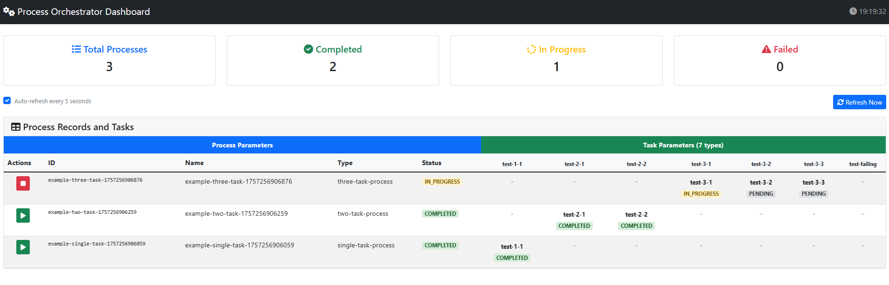

# Process Orchestrator

A comprehensive process orchestration system built on top of `db-scheduler` that enables sequential task execution with automatic progression, retry mechanisms, and comprehensive result persistence.



## Table of Contents

- [Architecture Overview](#architecture-overview)
- [Database Schema](#database-schema)
- [Main Classes](#main-classes)
- [Usage Examples](#usage-examples)
- [Installation Guide](#installation-guide)
- [API Documentation](#api-documentation)
- [Features](#features)
- [Project Structure](#project-structure)

## Architecture Overview

The Process Orchestrator follows a modular architecture with clear separation of concerns:

### Core Components

1. **Process Orchestrator Core** (`process-orchestrator-core`)
   - Central orchestration engine
   - Process and task lifecycle management
   - Database persistence layer
   - CLI task execution engine

2. **Process UI Module** (`process-ui-module`)
   - Web-based dashboard for process monitoring
   - REST API for process and task data
   - Real-time status updates
   - Task details viewer

3. **DB Scheduler UI Module** (`db-scheduler-ui-module`)
   - Integration with db-scheduler's built-in UI
   - Task scheduling and execution monitoring
   - Historical task data visualization

### Data Flow

```
User Request → Process UI → Process Orchestrator → DB Scheduler → PostgreSQL
     ↓              ↓              ↓                    ↓
Web Dashboard ← REST API ← Process Logic ← Task Execution ← Database
```

### Key Design Principles

- **Sequential Execution**: Tasks within a process execute one after another
- **State Persistence**: All process and task states are persisted to PostgreSQL
- **Fault Tolerance**: Automatic retry mechanisms with configurable limits
- **Scalability**: Support for concurrent process execution
- **Observability**: Comprehensive logging and monitoring capabilities

## Database Schema

The system uses a simplified 3-table schema optimized for process orchestration:

### 1. `scheduled_tasks` Table
**Role**: Core db-scheduler table for task scheduling and execution

| Column | Type | Description |
|--------|------|-------------|
| `task_name` | VARCHAR(255) | Name of the task type |
| `task_instance` | VARCHAR(255) | Unique instance identifier |
| `task_data` | BYTEA | Serialized task data |
| `execution_time` | TIMESTAMP WITH TIME ZONE | When the task should execute |
| `picked` | BOOLEAN | Whether the task is currently being executed |
| `picked_by` | VARCHAR(50) | Which instance picked the task |
| `last_success` | TIMESTAMP WITH TIME ZONE | Last successful execution |
| `last_failure` | TIMESTAMP WITH TIME ZONE | Last failed execution |
| `consecutive_failures` | INTEGER | Number of consecutive failures |
| `last_heartbeat` | TIMESTAMP WITH TIME ZONE | Last heartbeat from executor |

### 2. `process_record` Table
**Role**: User-managed process templates and their execution state

| Column | Type | Description |
|--------|------|-------------|
| `id` | VARCHAR(255) | Unique process identifier |
| `type` | VARCHAR(100) | Process type name |
| `input_data` | TEXT | Input data for the process |
| `schedule` | VARCHAR(100) | Cron schedule (optional) |
| `current_status` | VARCHAR(50) | Current process status |
| `current_task_index` | INTEGER | Index of currently executing task |
| `total_tasks` | INTEGER | Total number of tasks |
| `started_when` | TIMESTAMP | When the process started |
| `completed_when` | TIMESTAMP | When the process completed |
| `failed_when` | TIMESTAMP | When the process failed |
| `stopped_when` | TIMESTAMP | When the process was stopped |
| `last_error_message` | TEXT | Last error message |
| `triggered_by` | VARCHAR(255) | What triggered this process |
| `created_at` | TIMESTAMP | Creation timestamp |
| `updated_at` | TIMESTAMP | Last update timestamp |

### 3. `tasks` Table
**Role**: Individual task execution records and results

| Column | Type | Description |
|--------|------|-------------|
| `id` | VARCHAR(255) | Unique task identifier |
| `process_record_id` | VARCHAR(255) | Reference to process record |
| `task_index` | INTEGER | Position in process sequence |
| `task_name` | VARCHAR(255) | Task name |
| `status` | VARCHAR(50) | Task execution status |
| `command` | TEXT | Command to execute |
| `working_directory` | VARCHAR(500) | Working directory for command |
| `timeout_minutes` | INTEGER | Timeout in minutes |
| `retry_count` | INTEGER | Current retry count |
| `max_retries` | INTEGER | Maximum retry attempts |
| `started_at` | TIMESTAMP | When task execution started |
| `completed_at` | TIMESTAMP | When task execution completed |
| `error_message` | TEXT | Error message if failed |
| `exit_code` | INTEGER | Command exit code |
| `output` | TEXT | Command output |
| `metadata` | JSONB | Additional task metadata |

## Main Classes

### Core Module (`process-orchestrator-core`)

#### `ProcessOrchestrator`
**Role**: Central orchestration engine
- Manages process lifecycle (start, execute, complete, fail)
- Coordinates sequential task execution
- Handles task retries and error recovery
- Maintains process state and context

#### `ProcessRecordController`
**Role**: CRUD operations for process records
- Create, read, update, delete process records
- Validate process types and input data
- Provide REST API endpoints for process management

#### `ProcessTypeRegistry`
**Role**: Process type definitions and management
- Stores available process types and their task definitions
- Provides type validation and lookup
- Centralized process type configuration

#### `ProcessTypeInitializer`
**Role**: Process type initialization
- Registers default process types
- Centralizes all process type definitions
- Ensures consistent process type availability

#### `CLITaskExecutor`
**Role**: Command-line task execution
- Executes CLI commands for tasks
- Handles cross-platform command execution
- Manages command timeouts and output capture

#### `ProcessRecordDAO`
**Role**: Database access layer
- CRUD operations for process records
- Database connection management
- Query optimization and performance

### UI Module (`process-ui-module`)

#### `ProcessUiController`
**Role**: REST API for UI dashboard
- Provides process and task data for dashboard
- Handles task details API endpoints
- Serves HTML pages for UI

#### `ProcessDashboardController`
**Role**: Web page serving
- Serves dashboard HTML pages
- Handles page routing and navigation

#### `ProcessUiBeanConfig`
**Role**: Spring configuration
- Configures Spring beans for UI module
- Initializes process type registry
- Sets up dependency injection

### Model Classes

#### `ProcessRecord`
**Role**: Process record data model
- Represents a process template and its state
- Contains process metadata and execution status
- Immutable user-managed fields

#### `TaskData`
**Role**: Task execution data model
- Represents individual task information
- Contains command, status, and execution results
- Supports retry logic and error handling

#### `ProcessType`
**Role**: Process type definition
- Defines a reusable process template
- Contains task sequence and configuration
- Provides task definitions and metadata

## Usage Examples

### Creating a Process

```java
// 1. Initialize the orchestrator
ProcessTypeRegistry registry = new ProcessTypeRegistry();
ProcessTypeInitializer.registerDefaultProcessTypes(registry);
ProcessRecordDAO dao = new ProcessRecordDAO(dataSource);
ProcessRecordController controller = new ProcessRecordController(dao, registry);

// 2. Create a process record
ProcessType processType = registry.getProcessType("single-task-process");
ProcessRecordResponse response = controller.createProcessRecord(
    "my-process-001",
    processType,
    "Sample input data",
    null  // No schedule - run immediately
);

if (response.isSuccess()) {
    System.out.println("Process created: " + response.getProcessRecord().getId());
}
```

### Starting Process Execution

```java
// 1. Initialize the orchestrator
ProcessOrchestrator orchestrator = new ProcessOrchestrator(dataSource, registry);
orchestrator.start();

// 2. Start a process
String processId = orchestrator.startProcess("single-task-process", inputData);

// 3. Monitor process status
ProcessData process = orchestrator.getProcess(processId);
System.out.println("Process status: " + process.getStatus());
```

### Working with Tasks

```java
// 1. Get all tasks for a process
List<TaskData> tasks = orchestrator.getProcessTasks(processId);

// 2. Check individual task status
for (TaskData task : tasks) {
    System.out.println("Task: " + task.getName() + 
                      " Status: " + task.getStatus() +
                      " Exit Code: " + task.getExitCode());
}

// 3. Get task details
Map<String, Object> taskDetails = orchestrator.getTaskDetails(taskId);
```

### Available Process Types

The system comes with four predefined process types:

1. **`single-task-process`**: One task execution
   - Task: `test-1-1` - Simple echo command

2. **`two-task-process`**: Two sequential tasks
   - Task 1: `test-2-1` - First task
   - Task 2: `test-2-2` - Second task

3. **`three-task-process`**: Three sequential tasks
   - Task 1: `test-3-1` - First task
   - Task 2: `test-3-2` - Second task
   - Task 3: `test-3-3` - Third task

4. **`failing-process`**: Process that intentionally fails
   - Task: `test-failing` - Command that returns error code

### Process Lifecycle

```
PENDING → IN_PROGRESS → COMPLETED
    ↓         ↓
  FAILED ← STOPPED
```

- **PENDING**: Process created but not started
- **IN_PROGRESS**: Process is executing tasks
- **COMPLETED**: All tasks completed successfully
- **FAILED**: Process failed due to task failure
- **STOPPED**: Process was manually stopped

## Installation Guide

### Prerequisites

- **Java 17+**: Required for running the application
- **Maven 3.6+**: For building and dependency management
- **PostgreSQL 12+**: Primary database (H2 for testing)
- **Git**: For cloning the repository

### Step 1: Clone the Repository

```bash
git clone <repository-url>
cd process-orchestrator
```

### Step 2: Database Setup

#### Option A: PostgreSQL (Recommended for Production)

1. Install PostgreSQL 12+
2. Create a database:
   ```sql
   CREATE DATABASE process_orchestrator;
   CREATE USER process_user WITH PASSWORD 'your_password';
   GRANT ALL PRIVILEGES ON DATABASE process_orchestrator TO process_user;
   ```

3. Update database configuration in `application.properties`:
   ```properties
   spring.datasource.url=jdbc:postgresql://localhost:5432/process_orchestrator
   spring.datasource.username=process_user
   spring.datasource.password=your_password
   ```

#### Option B: H2 (For Development/Testing)

No additional setup required - H2 runs in-memory.

### Step 3: Build the Project

```bash
# Build all modules
mvn clean install

# Skip tests for faster build
mvn clean install -DskipTests
```

### Step 4: Run the Application

#### Start the Core Module

```bash
# Option 1: Using Maven
mvn exec:java -pl process-orchestrator-core

# Option 2: Using JAR
java -jar process-orchestrator-core/target/process-orchestrator-core-1.0.0-SNAPSHOT.jar
```

#### Start the Process UI

```bash
# Option 1: Using provided script
./start-process-ui.sh

# Option 2: Using Maven
mvn spring-boot:run -pl process-ui-module
```

The Process UI will be available at: `http://localhost:8082`

### Step 5: Verify Installation

1. Open the Process UI dashboard
2. Create a test process using the API
3. Monitor process execution
4. Check task details

### Configuration

#### Core Module Configuration

```properties
# Database Configuration
spring.datasource.url=jdbc:postgresql://localhost:5432/process_orchestrator
spring.datasource.username=postgres
spring.datasource.password=your_password

# Logging Configuration
logging.level.com.processorchestrator=INFO
logging.level.com.github.kagkarlsson=WARN
```

#### UI Module Configuration

```properties
# Server Configuration
server.port=8082

# Security Configuration
spring.security.user.name=admin
spring.security.user.password=admin123
spring.security.user.roles=ADMIN

# UI Configuration
process-ui.refresh-interval=5000
process-ui.auto-refresh=true
```

## API Documentation

The Process Orchestrator provides a comprehensive REST API documented in OpenAPI 3.0 format.

### Core API Endpoints

- **Process Records**: `/process-records`
  - `POST /process-records` - Create a new process record
  - `GET /process-records` - Get all process records
  - `GET /process-records/{id}` - Get process record by ID
  - `PUT /process-records/{id}` - Update process record
  - `DELETE /process-records/{id}` - Delete process record
  - `POST /process-records/{id}/start` - Start a process
  - `POST /process-records/{id}/stop` - Stop a process

- **Process Types**: `/process-types`
  - `GET /process-types` - Get available process types

### UI API Endpoints

- **Process Dashboard**: `/api/processes`
  - `GET /api/processes` - Get processes for dashboard
  - `GET /api/processes/{processId}` - Get process details

- **Task Details**: `/api/task-details`
  - `GET /api/task-details/{taskId}` - Get task details

- **Debug Endpoints**: `/api/debug`
  - `GET /api/debug/task-ids` - Get all task IDs

### OpenAPI Specification

The complete API specification is available in `openapi.yaml` and can be viewed using:
- Swagger UI
- Postman
- Any OpenAPI-compatible tool

## Features

- **Sequential Task Execution**: Processes execute tasks one after another with automatic progression
- **Process State Management**: Track process lifecycle (PENDING, IN_PROGRESS, COMPLETED, FAILED, STOPPED)
- **Task Persistence**: All task and process data stored in PostgreSQL via `db-scheduler`
- **Retry Mechanisms**: Failed tasks can be automatically retried with configurable limits
- **CLI Task Execution**: Execute command-line utilities with cross-platform support
- **Result Persistence**: Complete audit trail of all process and task executions
- **Parallel Process Support**: Multiple processes can run concurrently
- **Web UI Dashboard**: Monitor and manage tasks through a web-based interface
- **REST API**: Comprehensive API for programmatic access
- **Scalable**: Designed to handle 5000+ processes with 10+ tasks each

## Project Structure

```
process-orchestrator/
├── process-orchestrator-core/          # Core orchestration functionality
│   ├── src/main/java/
│   │   ├── com/processorchestrator/
│   │   │   ├── config/                 # Process type definitions
│   │   │   ├── controller/             # REST controllers
│   │   │   ├── dao/                    # Data access objects
│   │   │   ├── executor/               # Task execution
│   │   │   ├── model/                  # Data models
│   │   │   └── service/                # Business logic
│   │   └── resources/
│   │       └── schema.sql              # Database schema
├── process-ui-module/                  # Custom UI dashboard
│   ├── src/main/java/
│   │   └── com/processorchestrator/ui/
│   │       ├── controller/             # UI controllers
│   │       └── config/                 # UI configuration
│   └── src/main/resources/
│       ├── templates/                  # Thymeleaf templates
│       └── static/                     # Static resources
├── db-scheduler-ui-module/             # DB Scheduler UI integration
├── openapi.yaml                        # API documentation
├── README.md                           # This file
└── image.png                           # UI example screenshot
```

## License

This project is licensed under the MIT License.
